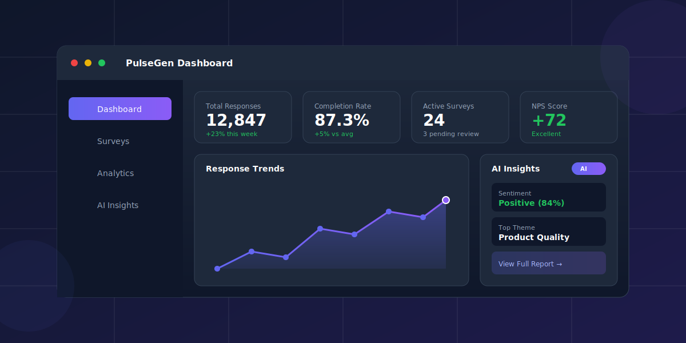

<div align="center">


# PulseGen

### The Open-Source Survey Platform with AI Superpowers

Create beautiful surveys, collect responses at scale, and unlock insights with AI—all self-hosted on your infrastructure.

[](https://github.com/genesis-nexus/pulsegen/actions/workflows/ci.yml)
[](LICENSE)
[](https://www.typescriptlang.org/)
[](https://reactjs.org/)
[](https://nodejs.org/)
[](CONTRIBUTING.md)

[Features](#features) • [Quick Start](#quick-start) • [AI Features](#-supercharge-with-ai) • [Documentation](#documentation)



</div>

---

## Why PulseGen?

| | Traditional Survey Tools | PulseGen |
|---|---|---|
| **Data Ownership** | Their servers, their rules | Your infrastructure, your data |
| **AI Analysis** | Paid add-on or unavailable | Bring your own AI keys |
| **Customization** | Limited theming | Full white-label + custom CSS |
| **Pricing** | Per response or seat | Free forever (self-hosted) |
| **Lock-in** | Proprietary formats | Export everything, run anywhere |

---

## Features

<table>
<tr>
<td width="50%" valign="top">

### Build

- **24 Question Types** — From NPS to matrix grids, signatures to geo-location
- **Drag & Drop Builder** — Visual canvas with real-time preview
- **Smart Logic** — Skip logic, branching, piping, conditional display
- **Multi-Page Surveys** — Organize with custom pagination
- **Themes & Branding** — Custom colors, logos, fonts, and CSS

</td>
<td width="50%" valign="top">

### Distribute

- **Instant Sharing** — Links, QR codes, embed widgets
- **Participant Management** — Import lists, track completions, send reminders
- **Access Control** — Public, private, password-protected, or token-based
- **Save & Continue** — Let respondents resume later
- **Quotas** — Auto-close when targets are met

</td>
</tr>
<tr>
<td width="50%" valign="top">

### Analyze

- **Real-Time Dashboard** — Live response tracking and completion rates
- **Question Analytics** — Distributions, cross-tabs, source tracking
- **Multiple Exports** — CSV, Excel, PDF, JSON
- **Trend Analysis** — Track responses over time

</td>
<td width="50%" valign="top">

### Scale

- **Workspaces** — Organize surveys and teams
- **Role-Based Access** — Admin, Manager, Viewer permissions
- **SSO Ready** — Google, Microsoft, GitHub, SAML, OIDC
- **API First** — RESTful API with key-based auth
- **Multi-Language** — 10+ languages with RTL support

</td>
</tr>
</table>

---

## ✨ Supercharge with AI

Connect your own AI provider and unlock powerful automation. **No per-usage fees**—just your API costs.

<table>
<tr>
<td align="center" width="25%">
<br />
<strong>Generate</strong>
<br /><br />
Describe your survey in plain English. Get a complete, ready-to-publish survey in seconds.
<br /><br />
</td>
<td align="center" width="25%">
<br />
<strong>Optimize</strong>
<br /><br />
AI reviews your questions for clarity, bias, and engagement. One-click improvements.
<br /><br />
</td>
<td align="center" width="25%">
<br />
<strong>Analyze</strong>
<br /><br />
Sentiment detection, theme extraction, and smart summaries from open-ended responses.
<br /><br />
</td>
<td align="center" width="25%">
<br />
<strong>Translate</strong>
<br /><br />
Instantly translate surveys to 12+ languages with quality review.
<br /><br />
</td>
</tr>
</table>

**Works with:** OpenAI (GPT-4) • Anthropic (Claude) • Google (Gemini) • Azure OpenAI

> **Note:** AI features are optional. PulseGen works perfectly without them—add AI when you're ready.

---

## Quick Start

### Docker (Recommended)

```bash
git clone https://github.com/genesis-nexus/pulsegen.git
cd pulsegen

# Configure environment
cp backend/.env.example backend/.env
# Edit backend/.env with your database credentials

# Start everything
docker-compose up -d
```

**That's it!** Open [http://localhost:3001](http://localhost:3001)

### Local Development

```bash
# Backend
cd backend
npm install
npx prisma migrate dev
npm run dev

# Frontend (new terminal)
cd frontend
npm install
npm run dev
```

---

## Tech Stack

| Layer | Technologies |
|-------|-------------|
| **Frontend** | React 18, TypeScript, Tailwind CSS, React Query |
| **Backend** | Node.js, Express, Prisma ORM |
| **Database** | PostgreSQL |
| **Cache** | Redis (optional) |
| **AI** | OpenAI, Anthropic, Google AI SDKs |

---

## Documentation

| Guide | Description |
|-------|-------------|
| [Setup Guide](docs/SETUP.md) | Detailed installation instructions |
| [Self-Hosting](docs/self-hosting.md) | Production deployment guide |
| [API Reference](docs/api.md) | REST API documentation |
| [Contributing](CONTRIBUTING.md) | How to contribute |

---

## Contributing

We welcome contributions! Whether it's bug fixes, new features, or documentation improvements—check out our [Contributing Guide](CONTRIBUTING.md) to get started.

---

## License

PulseGen is open-source under the [MIT License](LICENSE). Use it freely for personal and commercial projects.

---

<div align="center">

**[Get Started](#quick-start)** • **[Report Bug](https://github.com/genesis-nexus/pulsegen/issues)** • **[Request Feature](https://github.com/genesis-nexus/pulsegen/issues)**

Built with ❤️ for the open-source community

</div>
