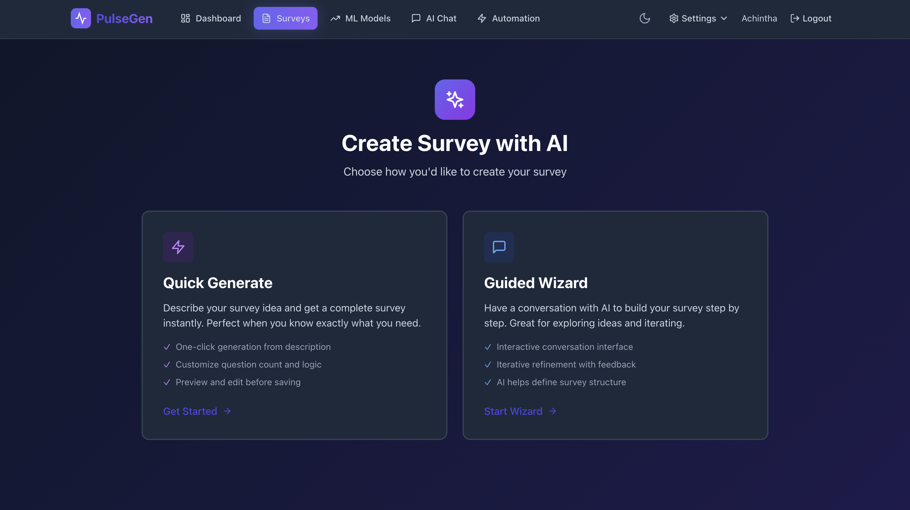

# PulseGen Documentation
{: .fs-9 }

The Open-Source Survey Platform with AI Superpowers
{: .fs-6 .fw-300 }

Create beautiful surveys, collect responses at scale, and unlock insights with AI—all self-hosted on your infrastructure.
{: .fs-5 .fw-300 }

[Get Started](){: .btn .btn-primary .fs-5 .mb-4 .mb-md-0 .mr-2 }
[View on GitHub](https://github.com/genesis-nexus/pulsegen){: .btn .fs-5 .mb-4 .mb-md-0 }

---

---

## Why PulseGen?

| | Traditional Survey Tools | PulseGen |
|---|---|---|
| **Data Ownership** | Their servers, their rules | Your infrastructure, your data |
| **AI Analysis** | Paid add-on or unavailable | Bring your own AI keys |
| **Customization** | Limited theming | Full white-label + custom CSS |
| **Pricing** | Per response or seat | Free forever (self-hosted) |
| **Lock-in** | Proprietary formats | Export everything, run anywhere |

---

## Key Features

### Build Powerful Surveys

- **24 Question Types** — From NPS to matrix grids, signatures to geo-location
- **Drag & Drop Builder** — Visual canvas with real-time preview
- **Smart Logic** — Skip logic, branching, piping, conditional display
- **Multi-Page Surveys** — Organize with custom pagination
- **Themes & Branding** — Custom colors, logos, fonts, and CSS

### Distribute Effortlessly

- **Instant Sharing** — Links, QR codes, embed widgets
- **Participant Management** — Import lists, track completions, send reminders
- **Access Control** — Public, private, password-protected, or token-based
- **Save & Continue** — Let respondents resume later

### Analyze with AI

- **AI Survey Generation** — Describe your survey in plain English
- **Sentiment Analysis** — Understand response emotions automatically
- **Smart Summaries** — AI-powered insights from open-ended responses
- **Multi-Language** — Instant translation to 12+ languages

---

## Quick Links

{: .note }
New to PulseGen? Start with the [Getting Started Guide]().

| Guide | Description |
|:------|:------------|
| [Getting Started]() | Quick setup and first survey |
| [Self-Hosting]() | Deploy on your infrastructure |
| [Deployment Guide]() | Cloud and production deployments |
| [API Reference]() | REST API documentation |
| [AI Features]() | Configure AI providers |
| [Configuration]() | Environment variables and settings |

---

## Tech Stack

| Layer | Technologies |
|:------|:-------------|
| **Frontend** | React 18, TypeScript, Tailwind CSS, React Query |
| **Backend** | Node.js, Express, Prisma ORM |
| **Database** | PostgreSQL |
| **Cache** | Redis (optional) |
| **AI** | OpenAI, Anthropic, Google AI SDKs |

---

## Community

PulseGen is open-source under the [MIT License](https://github.com/genesis-nexus/pulsegen/blob/main/LICENSE).

- [GitHub Repository](https://github.com/genesis-nexus/pulsegen)
- [Report Issues](https://github.com/genesis-nexus/pulsegen/issues)
- [Request Features](https://github.com/genesis-nexus/pulsegen/issues)
- [Contributing Guide](https://github.com/genesis-nexus/pulsegen/blob/main/CONTRIBUTING.md)
